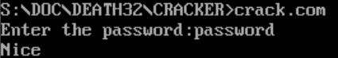
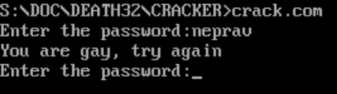

# Crack me

## Программа с заложенными уязвимостями

### Описание задания

Нужно было написать программу, принимающую пароль и проверяющую его на истинность. Так же, в задаче нужно было целенаправленно допустить две уязвимости (простую и тяжелую по сложности). Программа исполнялась в виртуальной машине операционной системы MS - DOS - DOSBox, так как в данной ОС отсутствуют какие-либо ограничения на использование памяти, что сильно упрощает взлом.

### Моя программа

Моя программа записана в файле [СRACK.ASM](CRACK.ASM). Она спрашивает у пользователя пароль и сравнивает его с истинным значением ` password `, а затем, в зависимости от его истинности, выводит сообщение о подтверждении входа или об ошибке.

#### Случай ввода верного пароля



#### Случай ввода неверного пароля



### Лёгкая уязвимость

Лёгкой уязвимостью в моей программе считается считывание юольшего количества символов чем ожидает программа и расположение хэша эталонного пароля сразу после буффера ввода:

```
   input           db 18, 10 dup (0)
   password_hash   dw 5728h
```

#### Ввод от лица пользователя:


### Средняя по сложности уязвимость

Данная уязвимость заключалась в том, что программа пользуется .


## Взлом чужой программы

Я обменялся программами с пользователем [Urodish](https://github.com/kzueirf12345). Его файл расположен [тут](VZLOM.COM). Для дизассемблирования я использовал встроенную программу Turbo Debugger, а так же такие программы, как Radare2 и IDA.

### Лёгкая уязвимость

Лёгкой уязвимостью являлась оставленная проверка на то, что, если пароль начинается с символа '\0', то он должен считаться валидным. Таким образом, достаточно было ввести любой пароль с нулевым символом в начале, который вводится в терминале DOSBox комбиначией `Ctrl + @`.

#### Скриншот из Turbo Debugger'а, на котором видна эта проверка:


### Средняя по сложности уязвимость

Средней по сложности уязвимостью считалось "подвешивание" программы на 21h прерывание, которое обрабатывает вызовы функций DOS'а. Нужно было написать программу, подменяющую обработчик прерываний DOS'а и меняющий ip регистр, лежащий в стеке, то есть адрес возврата из прерывания. Данный метод позволяет при завершении обработки прерывания оказаться на вызове функции печати подтверждения пароля, пропуская его проверку. Такая программа прописана мной в файле [crack.asm](crack.asm). В ней я подсчитываю количество раз вызова обработчика прерывания и в нужный момент (при выводе строки с сообщением о неверном пароле) я меняю адрес возврата и убираю резидентную программу из памяти, подменяя её оригинальным обработчиком прерывания.

Другая версия использования данной уязвимости заключается в подмене адреса строки, которую хочет вывести программа в случае неверного пароля. Аналогично методу, описанному выше, я подсчитываю количество вызовов и в тот же момент, что и при замене адреса возврата, я меняю адрес вывода функции (регистр DX). Данная программа прописана в файле [crack_2.asm](crack_2.asm).

### Бинарный патч

[Программа](src/main.cpp) открывает файл `.COM` и меняет байт команды **JE** на команду **JMP** в проверке пароля на истинность. Таким образом, программа в любой ситуации считает пароль истинным, так как проверка всегда выдаёт результат совпадения паролей. Адрес нужного байта я так же узнал благодаря дизассемблированию. Итоговый результат записывается в файл [cracked.com](cracked.com).

#### Запуск программы после бинарного патча:


Так же данная программа логирует все свои действия и в параллельном потоке открывает окошко, в котором рисует движение картинки из файла [roflan.com](data/roflan.png) по траектории движения логотипа DVD, а так же запускает музыку из файла [VI_KA.mp3](data/VI_KA.mp3). Для работы с графикой используется библиотека SFML.

#### Вид окна, нарисованного программой:


## Отдельное сравнение дизассемблеров

Сравнение производилось на примере взлома программы от университета Вирджинии - [The Bomb Lab](https://www.google.com/url?sa=t&source=web&rct=j&opi=89978449&url=https://www.cs.virginia.edu/~cr4bd/3330/F2018/bomblab.html&ved=2ahUKEwjy1pO_jvWLAxWGPRAIHTHDG2cQFnoECCYQAQ&usg=AOvVaw0cDFj91T0ZLFPO9K6xn9_r). Её содержимое лежит в папке [bomb](bomb). Данная программа запрашивает пароль, а затем сравнивает его тем или иным способом. Всего в задаче заявлено 6 фаз (уровней сложности), то есть 6 разных паролей, которые нужно подобрать, или обойти их проверку другим способом.

В процессе взлома использовались такие программы, как IDA Free, Radare2 и Ghidra. На разных этапах каждая из этих программ была полезна.

### IDA

Плюсы IDA в том, что, во-первых, в ней удобнее всего перемещаться по дизассемблированному коду, во-вторых, она рисует дерево вызова функций, которое впоследствии помогло мне узнать одну интересную вещь - то, что помимо заявленных 6 фаз (уровней сложности) в бомбе была ещё одна секретная фаза, которую ниоткуда в программе явно не вызывают:


На данном графе видно отдельное дерево с вызовом "секретной" фазы, что увеличивает интерес данной задачи. Так же, наличие скрытой фазы можно было обнаружить благодаря разделу со строками в ассемблерном коде:


Среди строк можно найти поздравление с обнаружением секретной фазы (строка (1) на скриншоте), что позволяет убедиться в её наличии. Однако, среди строк можно также найти строку про недействительную фазу `Invalid phase` (строка (2) на скриншоте), что даёт основу для предположения о возможности перемещения между фазами без соблюдения порядка, прописанного в **main** функции.

### Ghidra

Ghidra также была полена. Она также строила дерево вызовов функций и jmp'ов , что помогало сравнить деревья двух данных дизассемблеров.


Дерево отличается от того, что было построено в IDA. Во-первых, оно показывает не только вызовы функций, но ещё и jump'ы, но не показывает эти вызовы во всей программе, в отличие от IDA. Так же имена мест, куда прыгает программа при выполнении того или иного **jump**'а или **call**'а, отличаются от тех, которые рисует IDA. Здесь видны лишь прыжки в библиотеку с функциями бомбы,

Это не единственный плюс данного дизассемблера. Следующее его преимущество - декомпиляция программы до языка высокого уровня.

P.S.: IDA тоже умеет декомпилировать, однако, данная функция доступна лишь в её платной версии, в отличие Ghidra.

#### Main

```

/* WARNING: Unknown calling convention */

int main(int argc,char **argv)

{
  char *pcVar1;

  if (argc == 1) {
     infile = stdin;
  }
  else {
     if (argc != 2) {
        __printf_chk(1,"Usage: %s [<input_file>]\n",*argv);
                            /* WARNING: Subroutine does not return */
        exit(8);
     }
     infile = (FILE *)fopen(argv[1],"r");
     if (infile == (FILE *)0x0) {
        __printf_chk(1,"%s: Error: Couldn\'t open %s\n",*argv,argv[1]);
                            /* WARNING: Subroutine does not return */
        exit(8);
     }
  }
  initialize_bomb();
  puts("Welcome to my fiendish little bomb. You have 6 phases with");
  puts("which to blow yourself up. Have a nice day!");
  pcVar1 = read_line();
  phase_1(pcVar1);
  phase_defused();
  puts("Phase 1 defused. How about the next one?");
  pcVar1 = read_line();
  phase_2(pcVar1);
  phase_defused();
  puts("That\'s number 2.  Keep going!");
  pcVar1 = read_line();
  phase_3(pcVar1);
  phase_defused();
  puts("Halfway there!");
  pcVar1 = read_line();
  phase_4(pcVar1);
  phase_defused();
  puts("So you got that one.  Try this one.");
  pcVar1 = read_line();
  phase_5(pcVar1);
  phase_defused();
  puts("Good work!  On to the next...");
  pcVar1 = read_line();
  phase_6(pcVar1);
  phase_defused();
  return 0;
}

```

#### Phase 1

```

void phase_1(char *param_1)

{
  undefined8 uVar1;

  uVar1 = strings_not_equal(param_1,"Border relations with Canada have never been better.");
  if ((int)uVar1 != 0) {
     explode_bomb();
  }
  return;
}

```

Так выглядят декомпилированные функции в Ghidra. Язык высокого уровня бывает проще понять, чем команды на ассемблере, так что данная функция Ghidra является её плюсом.

### Radare2

Radare2 я использовал в моменты, когда IDA выдавала ошибки дизассемблирования, а Ghidra выводила непонятную версию декомпиляции. Radare2 же полностью справлялся со своей задачей, оставляя комментарии и рисуя стрелочками дальнейшие передвижения в **jump**'ах и **call**'ах. Однако, главное его преимущество - это то, что он работает из терминала, в отличие от других дизассемблеров.

#### Вывод в дизассемблере кода с комментариями


#### Отображение зависимостей в **jump**'ах и **call**'ах


Так, например, он помог мне разгадать 5-ую фазу бомбы:

#### 5 фаза бомбы


В данной фазе производилось хеширование пароля и проверка хеша, а так же проверка длины пароля. Обращение шло с массивом символов:


### Сравнение

В данных программах есть, конечно, и схожие черты. Например, во всех трёх дизассемблерах можно переходить по именам функций и меткам с помощью Ctrl + клик ЛКМ.

Все три дизассемблера хороши по-своему, у каждого есть свои стороны, в которых они лучше других. Так, благодаря комбинации этих трёх программ я узнал о бомбе довольно много.

Так, например, я сначала нашёл в ассемблере, а затем уже проверил в терминале, что программа бомбы сама отлавливает выход из программы (комбинация `Ctrl+C`), а затем выводит сообщение и ждёт некоторое время перед выходом.

#### Дизассемблированный код в IDA


#### Вывод в терминале при завершении процесса


Более того, я смог разгадать 5 фаз бомбы. Теперь моя цель - две оставшиеся (6 и секретная 7 фазы).

#### Прохождение 5 фаз

